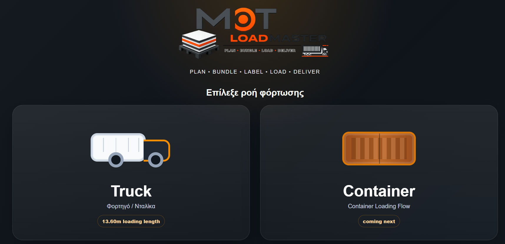
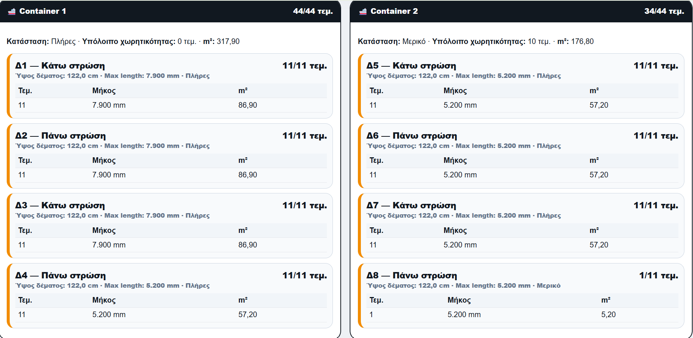
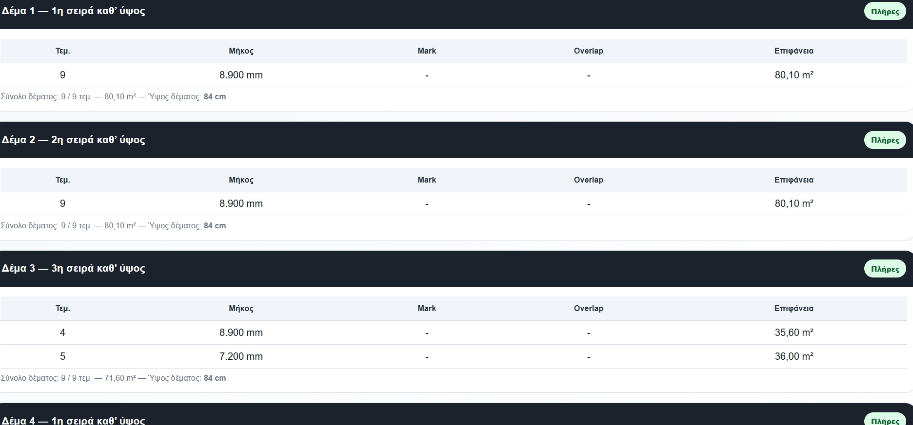
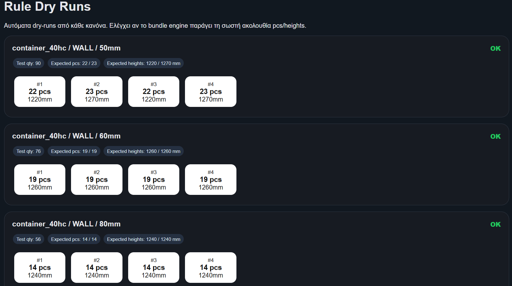

# LoadMaster

## Production, Packaging & Container Loading Platform

LoadMaster is an industrial software platform designed for manufacturers, logistics teams and export departments.

It automates packaging, bundle generation, shipment planning and container loading optimization while reducing manual calculations and planning errors.

---

## Key Capabilities

- Production Planning
- Bundle Optimization
- Container Loading
- Shipment Planning
- Automated Label Generation
- Rule-Based Validation Engine
- Excel Integration
- Export Documentation Support

---

## Workflow Selection

---

## Container Planning

Optimize bundle allocation across containers and maximize loading efficiency.

---

## Bundle Optimization

Automatically generate production bundles according to predefined loading and packaging rules.

---

## Rule Validation Engine

Built-in validation engine verifies packaging rules and loading sequences through automated dry runs.

---

## Technology Stack

- PHP
- MySQL
- JavaScript
- HTML5
- CSS3

---

## Industry Use Cases

- Manufacturing
- Logistics Operations
- Export Departments
- Industrial Production
- Building Materials Industry

---

## Status

Commercial project currently used in real production environments.

Custom implementations available.
